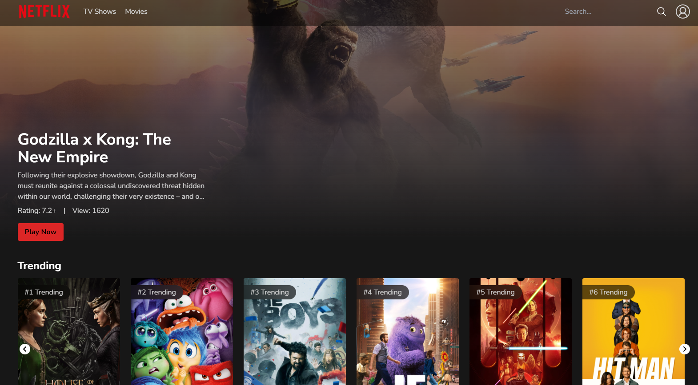

# Movies App

This app uses TMDB as backend to display movies and series content. You can see what it is popular, the top rated movies and what it is on the air.

The project is using React, Tailwind and Vite as Frameworks and an additional tool called Redux.

.

To see the functionality of Movies App, click on this link: https://movies-app-smoky-three.vercel.app/
